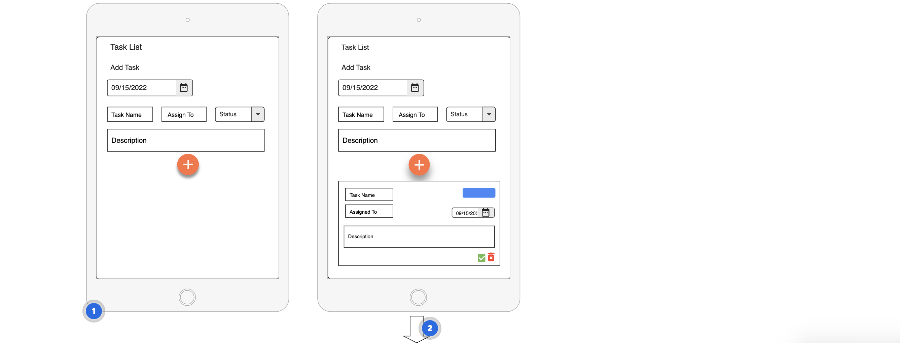
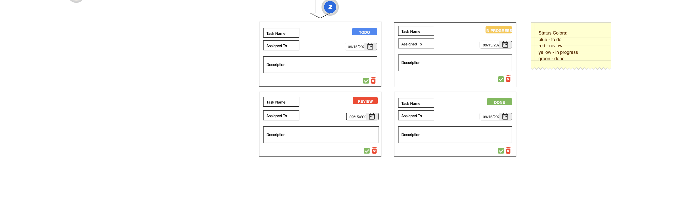
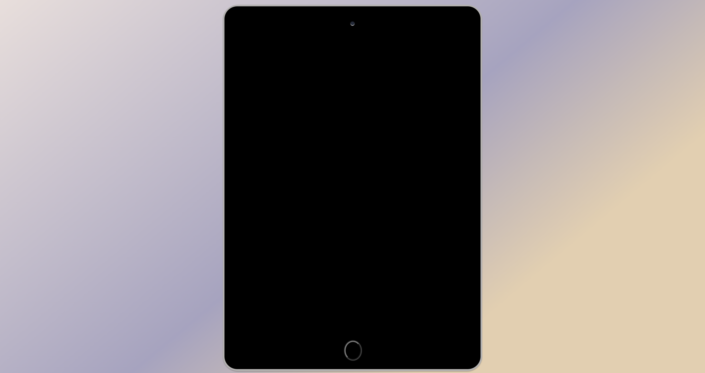
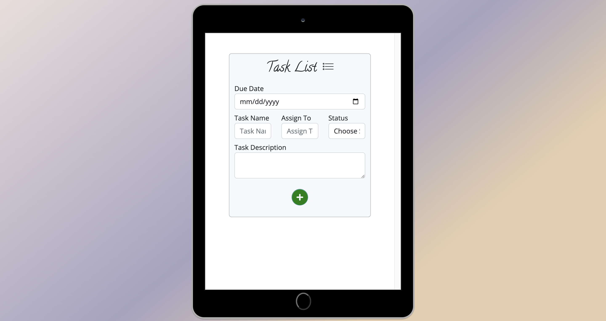

# Task List App

An interactive app that allows users to create tasks that need to be completed, using HTML, CSS, Bootstrap, and JavaScript.

The app is featured on an iPad, styled with CSS, to resemble an actual app on a device. There is a home button to turn on the iPad.

Check it out: [Task List App](https://ctrlaltree.github.io/006group-07/) 

## General Objective and Visuals:

The goal of the project is to create a task planner web app from scratch and demonstrate technical and non-techinical skills developed during Generation USA's Junior Web Developer program.

[Wireframe](https://app.moqups.com/MAFIW8Qaw8PI63e4IyJoChuyg6vqMBxV/edit/page/ad64222d5)

[Task List App](https://ctrlaltree.github.io/006group-07/)

Demo:
<video src="assets/images/tasklist-demo.mp4" controls></video>

## Contributing Members: 

[Shareese Rucker](https://github.com/CtrlAltRee)  
[Charles Wisda](https://github.com/CWisda)  
[Golder Otobotekere](https://github.com/GoldingGees)  
[Amare Legesse](https://github.com/AMARELEGESSE)  
[Sintayehu Gebreyohannes](https://github.com/sintukifle)  

## More Details:

The project consists of 10 tasks (~3 hours each) divided into 3 Sprints.

Each Sprint had an opening and a retrospective at the end following the Scrum methodology.

## Important Links
[Project Rubric](https://docs.google.com/spreadsheets/d/1pKK9KCnpraEcL7FQjxeMVeDWfjbypYRcSrXCyAVPtHo/edit#gid=1164902319)

[Generation Repository: Final Project Tasks](https://github.com/GenUSA-Learners/jwd-final-project)